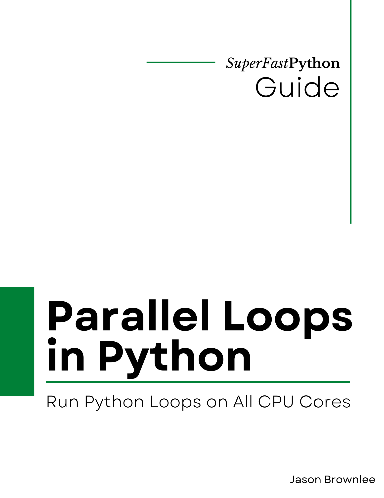

# Parallel Loops In Python

* <https://github.com/SuperFastPython/ParallelLoopsInPython>

This repository provides all source code for the book:

* **ParallelLoopsInPython**: _Run Python Loops on All CPU Cores_, Jason Brownlee, 2022.

## Source Code
You can access all Python .py files directly here:

* [src/](src/)

## Get the Book

You can learn more about the book here:

* [Gumroad](https://superfastpython.gumroad.com/l/plip)

### Book Blurb

> Are your loops slow?
>
> Why not run your loops in parallel?
> (using all cpu cores)
>
> Introducing: Parallel Loops in Python
>
> Discover this new Ebook that shows you how to execute Python loops in parallel using all CPU cores.